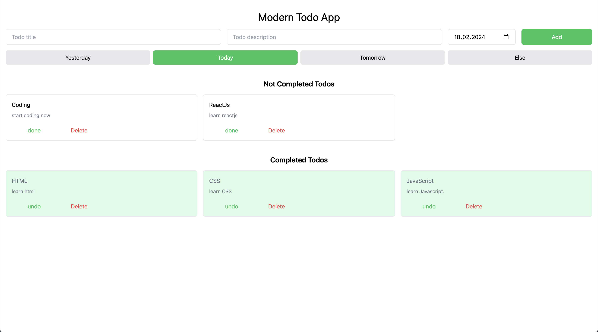

# ASMR-Todo App Readme

Welcome to ASMR-Todo, a todo list application built with ReactJS and TailwindCSS. This minimalist todo app not only helps you organize your tasks efficiently but also provides a calming ASMR experience while you manage your todos.

## YouTube link

## Screenshots

## Features
- **Create Todos:** Easily create new todos with a soothing interface.
- **Delete Todos:** Remove completed or unnecessary todos effortlessly.
- **Toggle Done/Undo:** Mark todos as done or undo them with a single click, maintaining your productivity flow.
- **Save Todos Locally:** Your todos are saved locally in your browser's storage, ensuring they persist between sessions.
- **Date Filters:** Filter todos based on date, including options for yesterday, today, tomorrow, and others.

## Technologies Used
- **ReactJS:** A popular JavaScript library for building user interfaces.
- **TailwindCSS:** A utility-first CSS framework for creating custom designs quickly.
- **LocalStorage API:** Utilized to save todos locally within the browser.

## Installation and Usage
1. Clone the repository to your local machine.
2. Navigate to the project directory.
3. Run `npm install` to install the necessary dependencies.
4. Start the development server by running `npm start`.
5. Access the application in your web browser at `http://localhost:3000`.

## How to Contribute
Contributions are welcome! If you'd like to enhance ASMR-Todo with new features, improve existing ones, or fix bugs, follow these steps:
1. Fork the repository.
2. Create a new branch (`git checkout -b feature/improvement-fix`).
3. Make your changes.
4. Commit your changes (`git commit -am 'Add new feature/improvement/fix'`).
5. Push to the branch (`git push origin feature/improvement-fix`).
6. Create a pull request explaining your changes.

## License
This project is licensed under the MIT License - see the [LICENSE](LICENSE) file for details.

---
Feel free to watch other videos on channel. Happy todo-listing with ASMR-Todo! 🌟